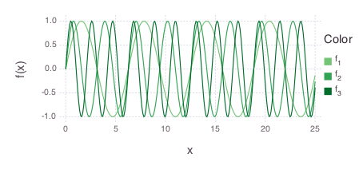

# ColorBrewer.jl

[](https://travis-ci.org/timothyrenner/ColorBrewer.jl)

A small library for generating color brewer color palettes.
For more information on color brewer, see http://colorbrewer2.org/.

## About

The color brewer palette collection was originally designed for maps, but is also useful for quickly generating nice colors for any kind of plot.

## Setup

This package is now registered. Add it with

```julia
Pkg.add("ColorBrewer");
```

You can also add it with

```julia
Pkg.clone("git://github.com/timothyrenner/ColorBrewer.jl.git");
```

## Usage

The module contains one function, `palette`, which takes a scheme name and an integer for the number of colors in the palette.
It returns an array of `RGB` values, which are defined in the [ColorTypes.jl](https://github.com/JuliaGraphics/ColorTypes.jl) package.

For example, to obtain a five color sequential green scheme, call

```julia
    using ColorBrewer

    greens = palette("Greens", 5);
```
Pretty simple stuff.

It can drop right into [Gadfly](https://github.com/dcjones/Gadfly.jl) plots.

```julia
    using Gadfly

    p = plot([x -> sin(n*x) for n in 1:3], 0, 25, 
             Scale.color_discrete_manual(greens[3:5]...))
```



If the `palette` function is passed an invalid scheme or number of colors, it throws an `ArgumentError`.

The schemes are broken up into three categories based on the type of data you want to show: sequential, diverging, and qualitative.

All sequential color schemes can have between 3 and 9 colors.
The available sequential color schemes are:

| Name    | Example                            |
|---------|------------------------------------|
| Blues   |  |
| Oranges |  |
| Greens  |  |
| Reds    |  |
| Purples |  |
| Greys   |  |
| OrRd    |  |
| GnBu    |  |
| PuBu    |  |
| PuRd    |  |
| BuPu    |  |
| BuGn    |  |
| YlGn    |  |
| RdPu    |  |
| YlOrBr  |  |
| YlGnBu  |  |
| YlOrRd  |  |
| PuBuGn  |  |

All diverging color schemes can have between 3 and 11 colors.
The available diverging color schemes are:

| Name     | Example                                     |
| -------- | ------------------------------------------- |
| Spectral |  |
| RdYlGn   |        |
| RdBu     |              |
| PiYG     |              |
| PRGn     |              |
| RdYlBu   |        |
| BrBG     |              |
| RdGy     |              |
| PuOr     |              |

The number of colors a qualitative color scheme can have depends on the scheme.
The available qualitative color schemes are:

| Name | Example                         |
| ---- | ------------------------------- |
| Set1 |  |
| Set2 |  |
| Set3 |  |
| Accent |  |
| Dark2 |  |
| Paired |  |
| Pastel1 |  |
| Pastel2 |  |

The `Paired` and `Set3` schemes can have between 3 and 12 colors.
The `Pastel1` and `Set1` schemes can have between 3 and 9 colors.
The `Set2`, `Accent`, `Dark2`, and `Pastel2` schemes can have between 3 and 8 colors.


## Thanks

Huge thanks to ikirill for providing the color scheme previews!
